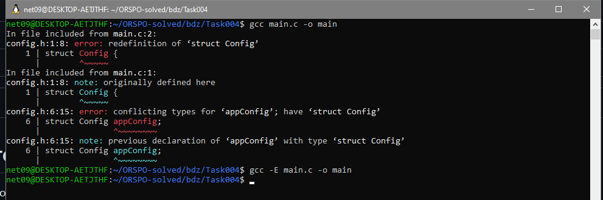

# Task004 — Многократное включение заголовочного файла 🔍

Скомпилируйте программу, состоящую из следующих файлов, используя команду:

```bash
gcc main.c -o main
```

# Задание

* Соберите программу. Какая ошибка появилась?

* Соберите программу с ключом `-E`. Что получилось на выходе? Почему файл `config.h` был включен дважды?

* Внесите изменения в файл `config.h`, чтобы запретить многократное подключение заголовочного файла.

* Соберите программу снова и убедитесь, что ошибка исчезла.

# Решение



* Собираем программу: выдает ошибку о переопределении struct при сборке (`redefenition of struct Config`).

* Собираем программу с ключом -E и смотрим получившийся файлик main. `config.h` был включен дважды по ошибке (и потому что в нем нет `#ifndef`)

* Откройте `config.h` командой `code config.h` и измените его на следующий код:

```C
#ifndef CONFIG
#define CONFIG

struct Config {
    int width;
    int height;
};

struct Config appConfig;

#endif
```

* Мы добавили 1, 2 и последнюю строчки. В случае, если CONFIG не определен, то config.h подставится полностью; если же
он не определен, то ничего не подставится. Таким образом можно избежать вторичного включения какого-либо файла в другой.
