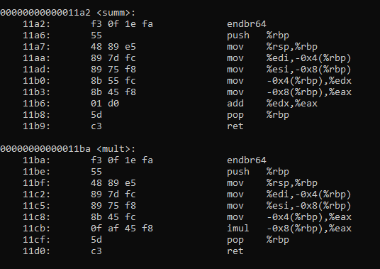
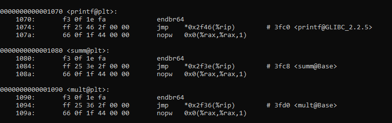

# Task009 — Статические и динамические библиотеки 🔍

## Команды для сборки

### Статическая библиотека

```bash
gcc -c main.c -o main1.o
gcc -c lib.c -o lib.o
ar cr libmain.a lib.o
gcc main1.o libmain.a -o main1
```

### Динамическая библиотека

```bash
gcc -c main.c -o main2.o
gcc -c lib.c -o lib.o
gcc -shared -o libmain.so lib.o
gcc main2.o libmain.so -Wl,-rpath,. -o main2
```

# Задание 

* Соберите программу двумя способами: со `статической` и `динамической` библиотекой.

* Выполните команды `ldd main1` и `ldd main2`. Объясните полученный результат.

* Выполните команды `objdump -d main1` и `objdump -d main2`. Найдите отличия в файлах.

* Запустите обе программы и убедитесь, что они работают одинаково.

* Удалите файл `libmain.so` и попробуйте запустить `main2`. Что произошло?

# Решение

* Собираем программу

* После выполнения команд выведится:

Для `ldd main1`:
```bash
linux-vdso.so.1 (0x00007ffc63d99000)
libc.so.6 => /lib/x86_64-linux-gnu/libc.so.6 (0x0000722e8e000000)
/lib64/ld-linux-x86-64.so.2 (0x0000722e8e3b2000)
```

Для `ldd main2`:
```bash 
linux-vdso.so.1 (0x00007ffd9ed7c000)
libmain.so => ./libmain.so (0x000070574e90a000)
libc.so.6 => /lib/x86_64-linux-gnu/libc.so.6 (0x000070574e600000)
/lib64/ld-linux-x86-64.so.2 (0x000070574e916000)
```

Разница в том, что `статическая` библиотека *встраивает* все подключаемые библиотеки непосредственно в файл `main1` (т.е. программа `main1` не зависит ни от каких *сторонних* библиотек, поскольку они все уже в неё встроены). `Динамическая` библиотека же просто создает ссылку на файл, в котором находится библиотека и подключает её непосредственно в момент запуска программы (т.е. если библиотеки на компьютере нет, то программа не запустится). Данная ссылка показывается в строчке `libmain.so => ./libmain.so (0x000070574e90a000)` в `ldd main2`.

* `objdump` позволяет вывести ассемблерный код программы. В `статической` библиотеке будут написаны команды функций `summ`, `mult` (они находятся в конце вызванной функции), в динамической же библиотеке они тоже будут прописаны (в самом начале), но это будут "заглушки" - т.е. адрес на эти функции в нужной нам библиотеке (libmain.so). 

Ниже приведены фотографии как выглядят функции при `objdump` в статической и динамической библиотеке соответственно



